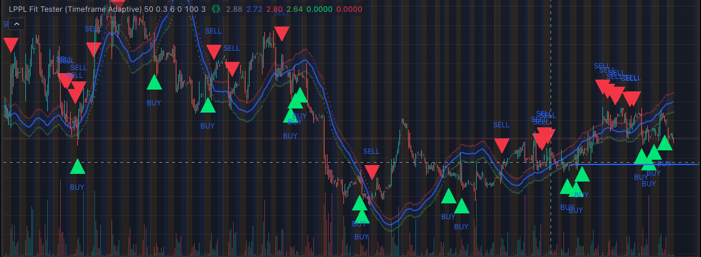

# momentum

Stock analysis stuff.

+ Strategies look at 1day / 7day momentum, MACD, RSI, EMA, scoring, combinations, etc.
+ Input an array of tickers to get analyzed, currently a const.

+ Pine script for LPPL Oscillation

+ LPPL V2

+ [Alpaca buy / sell example
](https://github.com/willfolsom/momentum/blob/main/src/momentum_alpaca.js)

## Observations

I have frontends for various things - repos are currently private but they exist.
