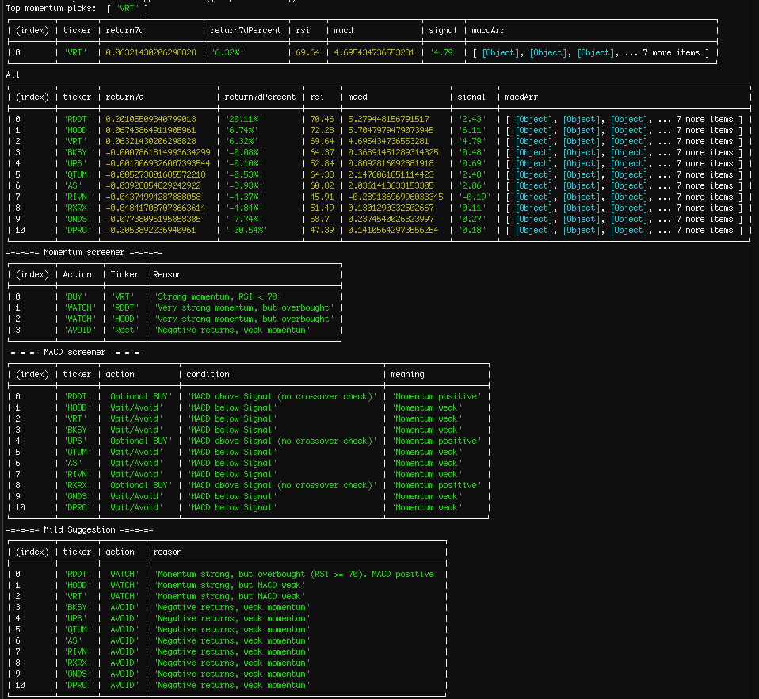
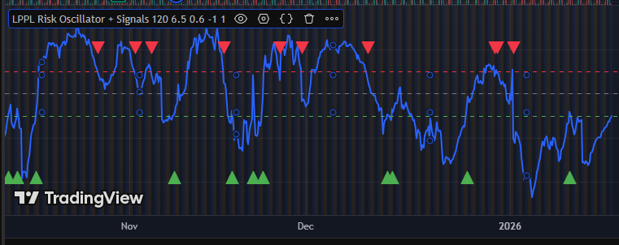

# momentum

Stock analysis stuff.

+ Strategies look at 1day / 7day momentum, MACD, RSI, EMA, scoring, combinations, etc.
+ Input an array of tickers to get analyzed, currently a const.

+ Pine script for LPPL Oscillation

+ Alpaca buy / sell example

## Observations

I have frontends for various things - repos are currently private but they exist.
